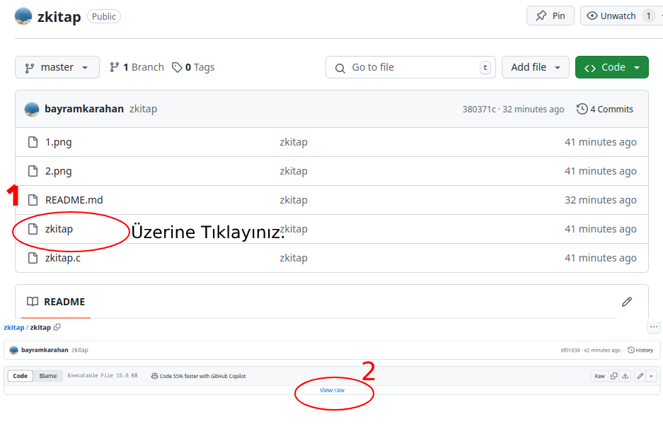
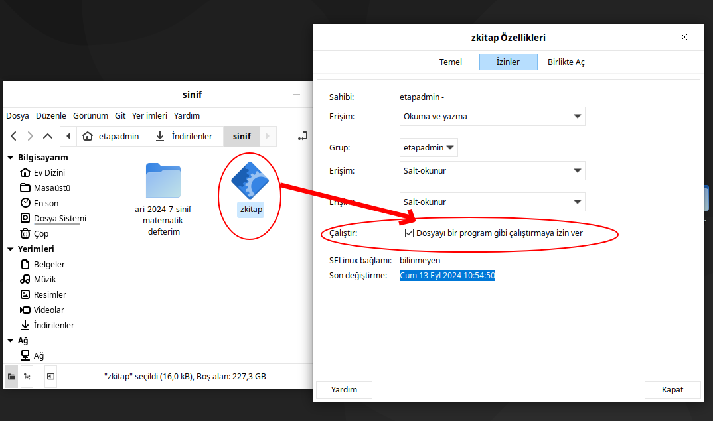
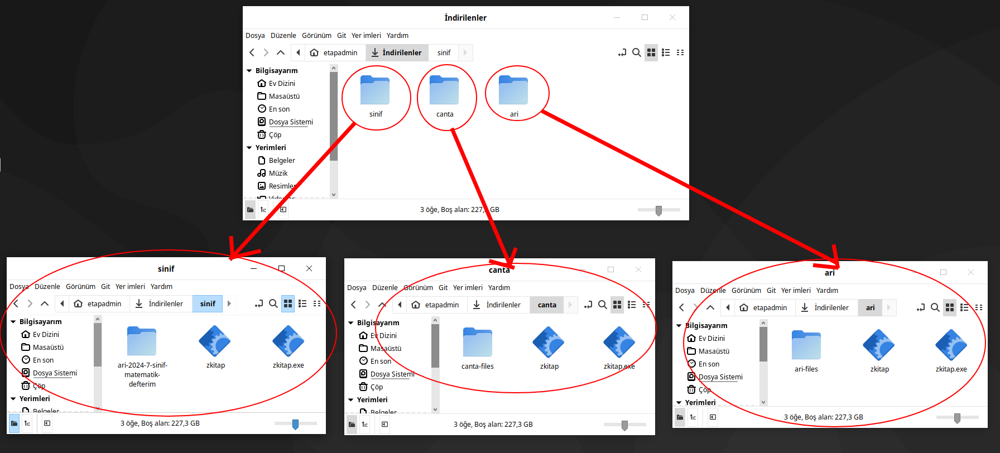

# zkitap Siyah Ekran

Bu zkitapların çalışması için küçük bir uygulama. Bu uygumanın çalışması için wine kurulu ve windows için hazırlanan z kitabı indirilmiş olması lazım.

1. Buradaki uygumalayı indirin

2. İndirdiğiniz dosyayı resimde görüldüğü gibi izinlerini değişitirin.

3. Çalıştırmak istediğiniz zkitabı indirin ve zkitap.exe olarak adını değiştiriniz

4. Aşağıdaki resimde görüldüğü gibi üç farklı yayın evinin zkitabı için ayarlamalar yapıldı.

5. **zkitap** uygulamasını çalıştırınız.

